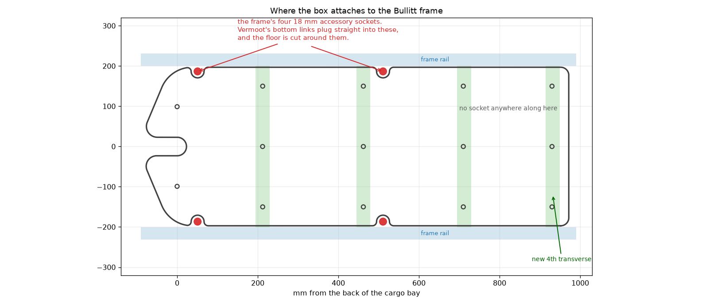

# Bullitt X cargo box panels

Vermoot's plywood box for the Original Bullitt, stretched to fit a Bullitt X.


## What changed, and why

The Bullitt X cargo bay is **220 mm longer than the Original Bullitt, and all of
the extra length is at the front**. Three things agree on this:

| | Original Bullitt | Bullitt X |
|---|---|---|
| Cargo bed at base (Larry vs Harry spec) | 710 mm | 930 mm |
| Cargo bed at top (Larry vs Harry spec) | 824 mm | 1044 mm |
| Total bike length (Larry vs Harry spec) | 2430 mm | 2650 mm |
| Floor transverses (from the two CAD models) | 3, at 212 / 462 / 710 | 4, at 212 / 462 / 712 / 932 |
| Inner width between the frame rails | 401 mm | 401 mm |

Line the two frames up by the back of the cargo bay and the Bullitt X's rear
cross brace and its first three floor transverses land on the Original's within
2 mm. The fourth transverse is new, 220 mm further forward. Bed top minus bed
base is 114 mm on both bikes, so the front and back walls lean at the same angle
and those two panels do not change at all.

So the panels are **not scaled**. Each one is cut through its straight middle
section and the front half is slid forward 220 mm. Every profile, radius and
bolt position at either end is exactly as Vermoot drew it.

## Files

Cut these two from 10 mm plywood, same as the originals:

- `panels/Side panel X.dxf` — 984.8 x 328.6 mm (was 764.8 x 326.4). Cut two, mirrored.
- `panels/fond X.dxf` — floor, 1048.4 x 394.0 mm (was 828.4 x 394.0).

**Unchanged — use Vermoot's originals as they are:** `front panel.dxf`,
`back panel.dxf`, `front link.stl`, `back link.stl`, `bottom link.stl`. They are
not copied into this repo; the design is Vermoot's and you already have it. Print
the same four bottom links, two back links and two front links as before.

## Bolt positions

x is measured from the back of the cargo bay, the same datum both DXFs already use.

**Side panel** — bottom-link bolts at x = 50.7 and 510.7 (both at y = 59),
back-link bolt at 50.7 / 303, front-link bolt at **983.1** / 200.9. Only the
front-link bolt moves; the other three are Vermoot's, untouched.

**Floor** — bolt rows at x = 212.2, 462, 710 and **930**, three bolts per row at
y = 0 and +/- 150. The first three rows are Vermoot's, unchanged; 930 is the new
fourth transverse. The two pairs of semicircular reliefs in the floor edge are
Vermoot's too, and stay where they are (see below).

## How the box hangs on the frame



The Bullitt frame has two cross tubes inside the cargo bay, at x = 50.8 and
510.8, each with an 18 mm vertical socket near either end at y = +/- 186.7.
**Vermoot's bottom link is a solid 18 mm peg that plugs into one of those
sockets** — it is not a clamp, and it will not mount anywhere else on the rail.
That is also what the semicircular reliefs in the floor edge are for: they clear
the socket and the foot of the link.

So the side panels have exactly four mounting points along the bottom and they
are fixed by the frame, not by the panel. A longer panel does not get more of
them. If your Bullitt X turns out to have a third pair of sockets further
forward, measure where they are and re-run the script with
`--extra-link-x <that x>`; it will add the panel bolt and the matching floor
relief. Otherwise the stretched panel runs unsupported along the bottom from
510.7 to the front link, 472 mm, which is 233 mm more than the original.

## Check this one dimension before you cut

The front-link bolt is at x = 983.1, which is Vermoot's 763.1 plus 220. The
Bullitt X model in `BullittX.FCStd` puts the front cross member about **9 mm
further forward and 9 mm lower** than a clean 220 mm shift predicts. That is
within the disagreement you would expect between two hand-built models — the
Bullitt model in the Vermoots project has its own cross beams at 250 and 248 mm
pitch, and puts the bed base at 715 mm where Larry vs Harry say 710 — but it
lands on the one hole that has no second bolt to average it out.

The cheap fix: cut the panel, offer it up, and drill the front-link hole last,
through the bracket, on the bike. Otherwise measure from the back of the bay to
the front link mount and compare with 983.

## Rebuilding the files

```
pip install ezdxf
python3 tools/make_bullittx_panels.py <folder with Vermoot's DXFs> panels/
python3 tools/preview.py <that folder> preview/bullittx-panels.png
```

`--extension` is the 220 mm, if you measure something different on your own bike.
`--extra-link-x` adds a bottom-link station, if your frame has a third socket pair.

## Cutting it on a CNC

`cnc/` has everything nested and ready to cut from 1/2" ply on a Shapeoko: the sheet
layouts as DXF and SVG, G-code, and the changes the thicker ply needs. Start with
[cnc/README.md](cnc/README.md).

## Fit check

`preview/fit-check.png` is the new geometry drawn over the Bullitt X frame from
`BullittX.FCStd`, aligned on the back of the cargo bay. The floor bolt rows
should sit on the red transverse marks.


## Child seat

The Larry vs Harry foldable seat bolts to the frame, not to the box, so the
220 mm stretch does not affect it and the Bullitt X gives it more room than a
standard Bullitt. What is worth checking before you commit: the box already
occupies all four of the frame sockets above, so if the seat wants the same
sockets, the two compete. The seat's own manual has its struts bolting to
"holes in the frame" from the outer side, and its lower bracket clamping the
shoulder tubes, which reads like a different set of mounting points — but that
is not confirmed. Dry-fit the seat before final assembly.

## Credit

The box design, the panel shapes and the three printed links are Vermoot's
"Plateformes Bullitt". This repo holds the two panels that had to change length,
the scripts that change them, and (under `cnc/`) all five panels adjusted and
nested for 1/2" ply.
