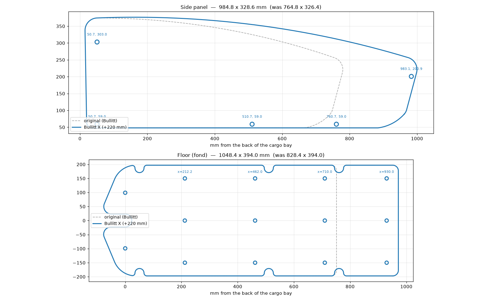
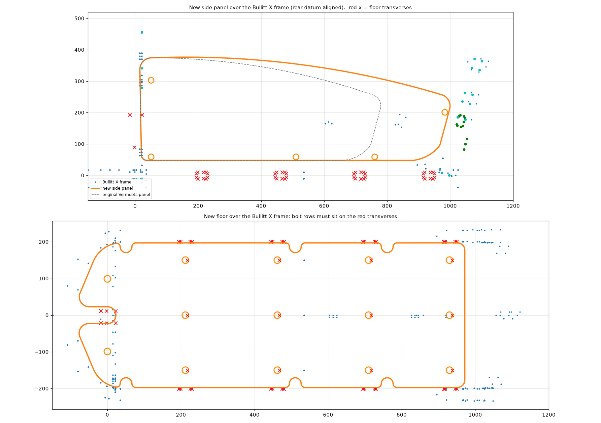

# Bullitt X cargo box panels

Vermoot's plywood box for the Original Bullitt, stretched to fit a Bullitt X.



## What changed, and why

The Bullitt X cargo bay is **220 mm longer than the Original Bullitt, and all of
the extra length is at the front**. Three things agree on this:

| | Original Bullitt | Bullitt X |
|---|---|---|
| Cargo bed at base (Larry vs Harry spec) | 710 mm | 930 mm |
| Cargo bed at top (Larry vs Harry spec) | 824 mm | 1044 mm |
| Total bike length (Larry vs Harry spec) | 2430 mm | 2650 mm |
| Floor transverses (from the two CAD models) | 3, at 212 / 462 / 710 | 4, at 212 / 462 / 712 / 932 |
| Inner width between the frame rails | 401 mm | 401 mm |

Line the two frames up by the back of the cargo bay and the Bullitt X's rear
cross brace and its first three floor transverses land on the Original's within
2 mm. The fourth transverse is new, 220 mm further forward. Bed top minus bed
base is 114 mm on both bikes, so the front and back walls lean at the same angle
and those two panels do not change at all.

So the panels are **not scaled**. Each one is cut through its straight middle
section and the front half is slid forward 220 mm. Every profile, radius and
bolt position at either end is exactly as Vermoot drew it.

## Files

Cut these two from 10 mm plywood, same as the originals:

- `panels/Side panel X.dxf` — 984.8 x 328.6 mm (was 764.8 x 326.4). Cut two, mirrored.
- `panels/fond X.dxf` — floor, 1048.4 x 394.0 mm (was 828.4 x 394.0).

**Unchanged — use Vermoot's originals as they are:** `front panel.dxf`,
`back panel.dxf`, `front link.stl`, `back link.stl`, `bottom link.stl`. They are
not copied into this repo; the design is Vermoot's and you already have it.

Print **six** bottom links instead of four (see below), and the usual two each of
the front and back links.

## Bolt positions

x is measured from the back of the cargo bay, the same datum both DXFs already use.

**Side panel** — bottom-link bolts at x = 50.7, 510.7 and **760.7** (all at y = 59),
back-link bolt at 50.7 / 303, front-link bolt at **983.1** / 200.9.

The bolt at 760.7 is the one thing here that is not just Vermoot's design moved.
The original panel hangs off two bottom links 460 mm apart plus the front link;
stretched, that would leave a 472 mm unsupported run of 10 mm ply along the
bottom edge. A third bottom link at 760.7 brings it back to 250 mm, uses the same
printed part, and clears the transverses at 712 and 932. The floor has a matching
relief cut for it. If you would rather not, re-run the script with
`--extra-link-x 0` and you get the two-link panel.

**Floor** — bolt rows at x = 212.2, 462, 710 and **930**, three bolts per row at
y = 0 and +/- 150. The first three rows are Vermoot's, unchanged; 930 is the new
fourth transverse.

## Check this one dimension before you cut

The front-link bolt is at x = 983.1, which is Vermoot's 763.1 plus 220. The
Bullitt X model in `BullittX.FCStd` puts the front cross member about **9 mm
further forward and 9 mm lower** than a clean 220 mm shift predicts. That is
within the disagreement you would expect between two hand-built models — the
Bullitt model in the Vermoots project has its own cross beams at 250 and 248 mm
pitch, and puts the bed base at 715 mm where Larry vs Harry say 710 — but it
lands on the one hole that has no second bolt to average it out.

The cheap fix: cut the panel, offer it up, and drill the front-link hole last,
through the bracket, on the bike. Otherwise measure from the back of the bay to
the front link mount and compare with 983.

## Rebuilding the files

```
pip install ezdxf
python3 tools/make_bullittx_panels.py <folder with Vermoot's DXFs> panels/
python3 tools/preview.py <that folder> preview/bullittx-panels.png
```

`--extension` is the 220 mm, if you measure something different on your own bike.

## Fit check

`preview/fit-check.png` is the new geometry drawn over the Bullitt X frame from
`BullittX.FCStd`, aligned on the back of the cargo bay. The floor bolt rows
should sit on the red transverse marks.



## Credit

The box design, the panel shapes and the three printed links are Vermoot's
"Plateformes Bullitt". This repo only holds the two panels that had to change
length, and the script that changes them.
