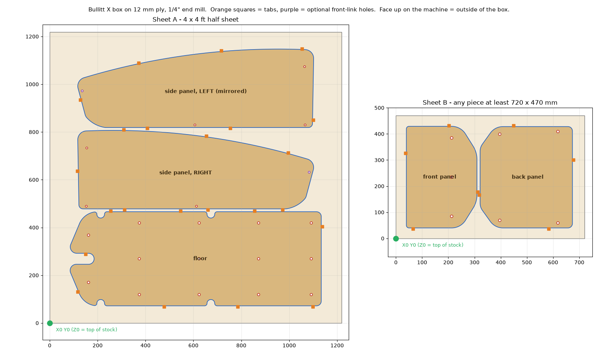

# Cutting the Bullitt X box on a Shapeoko 5 Pro from 1/2" ply



## It takes a half sheet plus a smaller piece

The floor and both side panels fill a 4 x 4 ft half sheet. The front and back
panels do not fit in what is left: the floor (394 mm) and the two side panels
(329 mm each) already use about 1075 mm of the 1219 mm, even nested tightly, and
the smallest side of the front panel is 271 mm. So:

| Sheet | Parts | Stock |
|---|---|---|
| **A** | floor, right side panel, left side panel | 4 x 4 ft half sheet |
| **B** | front panel, back panel | any piece at least **720 x 470 mm** (28.5 x 18.5 in); a 2 x 4 ft piece is plenty |

## Measure the ply, then pick the files

"1/2 inch" ply is usually 11.9 mm (15/32") or 12 mm (Baltic birch), sometimes a true
12.7 mm. Measure it with calipers in a few places and use the matching G-code:

| Measured thickness | Use |
|---|---|
| 11.7 to 12.3 mm | `gcode/*_12mm-stock.nc` (cuts 12.5 mm deep) |
| 12.4 to 13.0 mm | `gcode/*_12.7mm-stock.nc` (cuts 13.2 mm deep) |

Both cut about 0.5 mm into the spoilboard and leave 3 mm tabs.

## Machine setup

- **Tool:** 1/4" (6.35 mm) two-flute flat end mill. An upcut (Carbide 3D #201) works;
  a compression bit gives cleaner faces on both sides of the ply.
- **Spindle:** 18,000 rpm. On the Carbide router, set the dial by hand; the file sends `S18000`.
- **Feeds:** 1500 mm/min (59 ipm) cutting, 400 mm/min plunge, 800 mm/min in the holes,
  2.5 mm per lap. Deliberately conservative for a first run. Turn the feed override up
  if it sounds happy.
- **Zero:** X0 Y0 at the **front-left corner of the stock**, Z0 on the **top of the stock**.
  The BitZero corner probe does all three at once.
- **Safe height:** 15 mm above the stock. Keep clamps below that or out of the way of
  the parts.
- **Workholding:** every part stays attached by tabs (10 mm long, 3 mm thick; 9 on the
  floor, 7 per side panel, 4 each on the front and back). Screw the sheet down around the
  edge. Sheet A has at least 65 mm of clear margin all the way round. Put a few screws in
  the middle strips too if the sheet bows.

Each file cuts all its holes first, then each part outline. The outline is cut by
spiralling down 2.5 mm per lap with no plunges, followed by one clean-up lap at full
depth. Holes are helically bored with the same 1/4" bit (8 mm and 10 mm holes).

Rough run times at 100% feed: sheet A about 40 min, sheet B about 15 min.

## Run order

**Sheet A** (half sheet)
1. `sheet-A_floor-and-sides_front-link-holes-optional_<t>.nc`: **only if you want the
   front-link holes cut by the machine** (see below). Leave zero where it is.
2. `sheet-A_floor-and-sides_<t>.nc`

**Sheet B** (front/back piece)
1. `sheet-B_front-and-back_<t>.nc`

Cut the tabs with a flush-trim saw or chisel and sand them flush.

### The optional front-link holes

The side panel's front-link hole is the one dimension the previous check could not
pin down. The frame model puts that mount about 9 mm off where a clean 220 mm stretch
predicts. So it is in a separate file:

- Measure your bike first: the front link mount should be about 981 mm from the back
  of the cargo bay (the datum the main README uses). If it matches, run the optional file.
- If you're not sure, skip it, fit the panels, and drill the 8 mm hole through the bracket
  on the bike.

They are the purple holes in the picture above, and on their own layer
(`HOLES_front_link_optional`) in the DXF.

## Which side is which

Everything is cut with the **good face up**, so the face on top becomes the **outside**
of the box. The middle panel on sheet A is the **right** side panel (as Vermoot drew it)
and the top one is the **left** (mirrored). The floor, front and back panels are symmetric,
so either face can go up.

## What changed for 1/2" ply

The design was drawn for 10 mm ply. I thickened each panel in Vermoot's 3D assembly
(`Plateformes Bullitt Vermoot.step`) on the side it is free to grow and checked every
clash. Everything here is set for 12 mm. A true 12.7 mm sheet is only 0.7 mm off,
which the bolt holes and gaps absorb.

| Part | What happens with thicker ply | Change made |
|---|---|---|
| Side panels | Links bolt to the inside face, so they grow outward. The nearest frame tube is 7.8 mm away. | None to the outline |
| Front and back panels | Bolted to the frame by the outside face, so they grow into the box. The front and back links bolt to that inside face. | The front and back link bolt holes in the **side panel** move with the link: front one 1.9 mm back and 0.5 mm up (the front panel leans 15°), back one 2.0 mm forward |
| Floor | Sits on the cross beams and grows upward, eating Vermoot's 3 mm gap under the front and back panels (down to 0.2 mm at 12.7 mm). | **Bottom edge of the front and back panels trimmed 2 mm** to put the gap back |
| Bottom links | Peg into the frame and bolt to the side panel's inside face | None |
| Printed links | None of them change | Print as before: 2 front, 2 back, 4 bottom |

Other effects to know about:

- **Every bolt through the ply needs to be about 2 mm longer** (3 mm for 12.7 mm ply).
- The box is 4 mm wider outside (sides grow outward). Inside, it is 4 mm shorter and 2 mm shallower.
- The panels weigh about 20% more.

## Files

| File | What it is |
|---|---|
| `sheet-A_floor-and-sides.dxf` / `.svg` | Nested sheet A in mm, for Carbide Create or anything else |
| `sheet-B_front-and-back.dxf` / `.svg` | Nested sheet B |
| `gcode/*.nc` | Ready-to-run G-code as above |
| `parts/*.dxf` | Each part on its own, adjusted for 12 mm ply |

The DXFs and SVGs include the stock outline (layer `STOCK_OUTLINE_do_not_cut` or the grey
rectangle). Use it to line the drawing up with your stock, then delete it.

### Doing it in Carbide Create instead

Import the sheet SVG (it is sized in mm). Check the floor reads 1048.4 mm long. Set the
stock to the sheet size and measured thickness, with zero at the lower-left and on top. Then:

- **Contour, inside**, on the holes
- **Contour, outside**, on the parts, with tabs

Use the same tool and feeds as above.

## Checking or regenerating

```
pip install ezdxf shapely matplotlib
python3 tools/make_cnc.py <folder with Vermoot's DXFs>            # writes cnc/ and preview/cnc-sheets.png
python3 tools/backplot.py out.png cnc/sheet-A_floor-and-sides.dxf cnc/gcode/sheet-A_*12mm-stock.nc
```

`make_cnc.py` takes `--thickness` for the geometry and `--gcode-stock` for the depths,
plus the tool, feeds, tab and spacing settings. `backplot.py` reads the G-code back and
checks it against the nested DXF. Each file here passed with no gouges, nothing outside
the stock, every hole and outline cut through, and tabs only where intended.
`preview/backplot-sheet-A.png` shows the result for sheet A.
